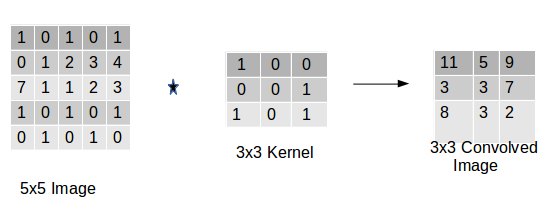
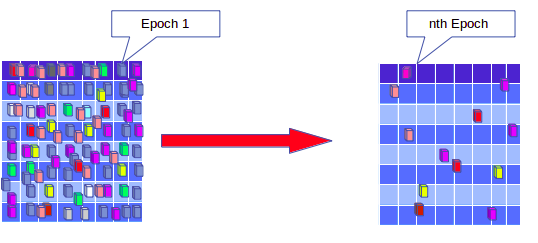
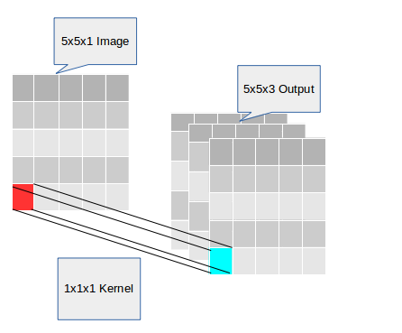
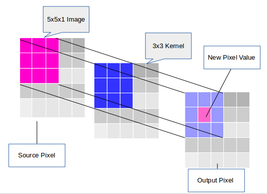
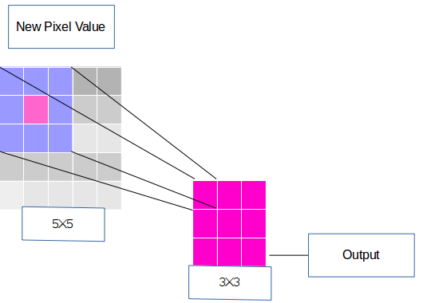
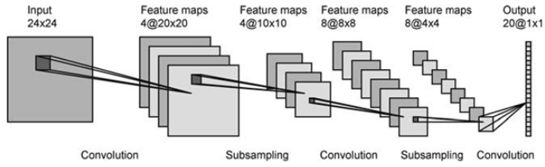

   

​                

**Name - Nitish.S**

**Batch - 3**

#                                                     ASSIGNMENT - 1

## CONVOLUTION

Convolution is mathmatical operation on two functions f1 and f2 doing which we get an output which shows how the first function is modified by the second function . Convolution comprises of summation of multipication of kernel values with the actua input. Idea of convolution was inspired by brain neuron mechanism. Input data passes through the black box, which comprises of filter/kernel(featured image). This combination of two function(Input data(image) and kernel(featured Image)) to produce output image. Convolved image intially looks in line, as convolution increases along with max pooling and activation function(Relu) output convolved image looks like curve,circle etc. 

Uses of Convolution:

1. It is fast to train and multiple items are found
2. Create multiple layer of network
3. No recognition of spatial layer, single item can be found.

Ex: For **3D**

If, we tel Input data((**6x6x3**) 6 - Width,6 - Height, 3 - Depth/Layer) which combines with Kernel((**3x3x3)** were 3 - Width,3 - Height, 3 - Depth/Layer) to produce  with output image((**4x4x1**)  4 - Width,4 - Height, 1 - Filter/Kernel )  

Ex :For 2D

## Kernel/Filters

 Kernels are filters of specific size which can learn specific feature from input image and feature are extracted when trained for specific amount of time. Kernel dimension can be set according to requirement and kernel strides(Moving/Jumping of kernel on orginal image or traversing the image).The vector of weights and bias(real numbers) which are related to  some feature of input image is called as kernel.

 Following Kernel steps:

​           Math behind the match

1. Line up the feature and image patch
2. Multiply each pixel by corresponding feature pixel
3. add them up

## EPOCHS

Training the network for all the  images in the train dataset is termed as one epoch. Simply understood as iteration over all input images is called one epoch. Epoch times may vary depending upon iterative algorithms to achieve max accuracy and need. Every epoch will be randomly shuffled, it means order of the images will be different for each epoch. Each epoch different features.

**Note**:  Iteration of every image takes place many times. But epoch is related to output update of image reaching an accuracy or we can say, it is complete pass through a given data set/module

## 1x1CONVOLUTION

1x1 Convolution is convolving kernel size to 1x1. 1x1 convolution operates one pixel at a time as shown in below image. We can increase number of channel with less number of multipication and addition, which doesn't cause as much data loss as higher size kernel. Generally, used at the end of  network.

## 3x3 CONVOLUTION

3x3 Convolution is convolving an image with kernel size of 3x3. 3x3 kernel multiply and add with each 3x3 patch of source image  to give new  value in Output image as shown below.  

Following important points of 3x3 convolution are:

1.Unlike 1x1, 3x3 gives the output were each pixel is result of 3x3 neighbour.

2.It is used beginning of network.

3.Without padding doesn't preserve image size.

4.Kernels can share the same weights.

## FEATURE MAPS

Feature map is the output activation for a given filter, which is also called as **Activation Maps**. Feature map is mapping which indicates where particular feature is present in the input image. The feature maps are learnt and becomes stronger over time as training procceds. Feature maps transforms the values from image space to feature space.

The number of feature maps depends on number of output channels defined for particular layer. 

## FEATURE ENGINEERING

A feature is a characterstics/part any items,living things or any geographic representation. Feature Engineering is a process of using features present in data to create useful input for the machine learning algorithms to give good result. Accuracy of output model depend on quality and quantity of features in the input data. For example, we take a song. Feature of a song will be intensity,genre, mood and instruments. In an image the edges,points,colours can be the some important features.

Steps of Feature Engineering are:

1. Analyzing/Testing the feature.
2. Deciding what features to be created to the given image.
3. Creating features based on our requirement.
4. Checking each features how our model works.
5. If necessary improving our features.
6. Go back to testing/creating more features until the work is done.

## ACTIVATION  FUNCTION

Activation function is the function present at the output of each node of the layer which controls the linearity or non-linearity of that particular node. It is important for our network not only to learn and compute linearity function but something more complicated. Hence, non - linearity activation function is used to learn complicated architecture between in hidden layers and extract images.

Popular types of activation function:

1. Sigmoid
2. Tanh - hyperbolic tangent
3. ReLu - Rectified Linear Unit

## GITHUB

Following steps to create GitHub:

1. Create a GitHub account.
2. Create a new repo on online.
3. Do git clone for cloning new repo.
4. git add file name.
5. git commit for commiting file to the repo.
6. git push for uploading local repo to remote repo.

My GitHub account link : https://github.com/Nitishsjce

## RECEPTIVE FIELD

Region in the input which influences particular part of the network is called Receptive Field. It can be increased adding more layers(Convolution,Maxpooling etc.).

